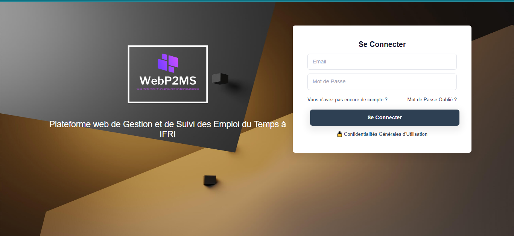
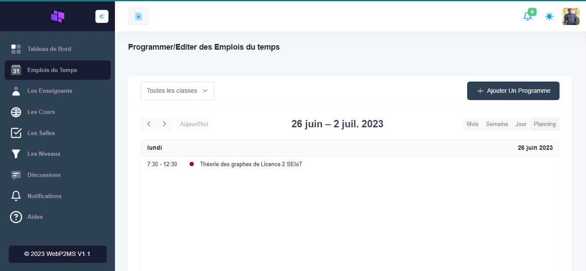

# WebP2MS

WebP2MS (Web Platform for Managing and Monitoring Schedules) est une application web de gestion des emplois du temps en temps réel pour les établissements d'enseignement supérieur ou secondaire.

## Fonctionnalités

- Gestion des enseignements et de la masse horaire [fait par les Coordonnateurs de formation]
- Planification des emplois de temps [fait par les Coordonnateurs de formation]
- Consultation des emplois du temps publiés [par les étudiants]
- Capacité de chatter sur un emploi du temps entre les enseignants et l'administration
- Envoi des emails sur divers événements(ajout ou modification d'un emploi du temps) à tout les acteurs concernés.
- Capacité d'installer l'application sur smartphone et sur PC en tant que application PWA

## Tech Stack

**Client:** HTML5, CSS3, Bootstrap 5, VueJS

**Server:** Django, MySQL

## License

Ce projet est distribué sous la licence
[MIT](https://choosealicense.com/licenses/mit/).

## Capture d'écran

